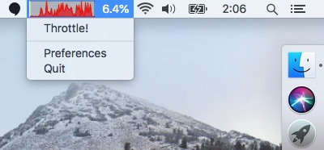
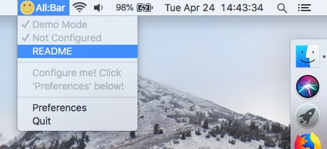

# AllBar

### The macOS Status Bar Multi Tool

A bigger (and slightly more complex) sibling of [AnyBar](https://github.com/tonsky/AnyBar). Check this out:

#### Description
A customizable macOS status bar thingamabob for anything you have to keep in mind (and in view!) while you work on your computer, like:

- time spent (i.e. time tracking)
- time left (like Pomodoro etc.)
- progress percentage
- exchange course
- short text status
- ...
- anything else you can fit in a short string and/or an icon 20px high ;-)

Also comes with a customizable pull down menu to trigger simple related actions, like:

- start tracking time for another project
- acknowledge a Pomodoro break
- pull up a specific website which in turn offers more complex actions like creating another time tracking project
- ...
- anything else you can trigger with a click on a menu item ;-)

Both the status bar ~~thingamabob~~ indicator and the pull down menu get configured and updated by the same simple JSON payload, which can be provided by any (local development) web server under your control, or even just a local JSON file. (Remember to overwrite that JSON file when you want to change the indicator.)

#### Table of Contents
- [Installation](#installation)
- [Usage](#usage)
- [Contributing](#contributing)
- [Credits](#credits)
- [License](#license)

#### Installation
1. Make sure you can run `python3` on your command line.
    - For instance, `python3` is made available by running `brew install python`. Consider installing [Homebrew](https://brew.sh/) if you haven't had a chance yet.
    - So far I've only run it with Python 3.6.4 and 3.6.5 on macOS 10.9 and 10.13. Please let me know how it goes for you!
2. Clone this GitHub repository to your macOS machine.
3. Run `install.sh` inside the local repository.
4. Now you should have an "AllBar" app in your `Applications` folder, but it can not do much on it's own yet, like a web browser without internet.
5. Pick one of the server script examples from the following list, customize it to your needs and start serving it from a URL accessible to your macOS machine.
    - [System Load Diagram](https://github.com/raphaelhuefner/allbar_server_system_load)
    - Sorry, this list is still very short at this time.
6. When launching the AllBar app for the first time, enter the URL of that server script into the "Preferences" dialog text box.

#### Usage
To be honest, I'm not sure what to write here yet. Usage totally depends on how you configure and sculpt the server script.

#### Contributing
Uncoded contributions (reviews, use cases, action shots, blog posts, criticism, documentation, etc.) big or small are **as much welcome as** any code contributions would be. If you think opening an issue or a pull request is not the right way to go, please stick my GitHub username in front of `@gmail.com` to get in touch with me directly.

**Before you invest any larger amounts of time into your contribution, please get in touch with me for coordination!**

Since this project is still in it's infancy, I'll gladly consider any feedback and/or contribution in any shape or form from anybody. (This policy might get revised if maintaining this project will ever start taking up too much of my time.)

#### Credits
This app is maintained by https://github.com/raphaelhuefner

This app is based on the [rumps](https://github.com/jaredks/rumps) library.

#### License
This app is released under the [MIT License](https://opensource.org/licenses/MIT). See the [LICENSE](https://github.com/raphaelhuefner/allbar/blob/master/LICENSE) file.
